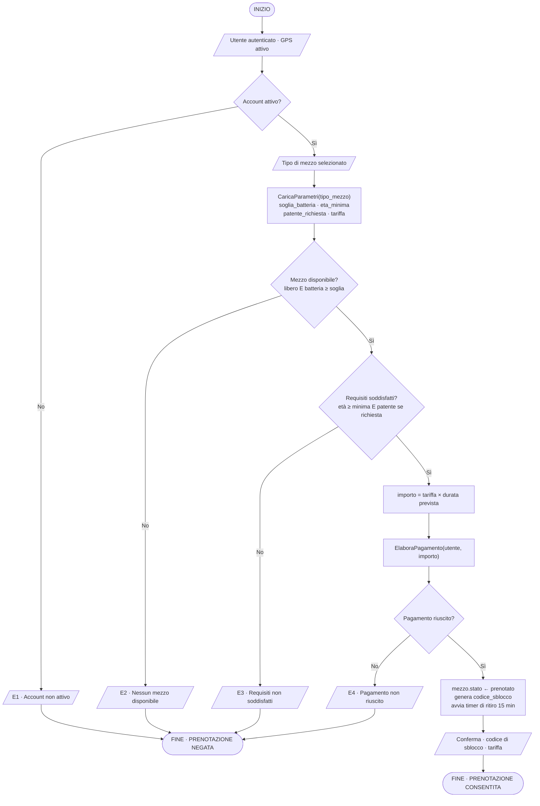

# Moove — Analisi logica di un sistema di prenotazione

> **Esercizio didattico.** Moove è un servizio di fantasia. Questa analisi è stata realizzata come progetto del modulo *Fondamenti di Sviluppo* del corso Full Stack Development & AI Agents di [Start2Impact University](https://www.start2impact.it/), a scopo esclusivamente formativo. Non descrive un sistema realmente in esercizio: dati, tariffe e parametri sono inventati a fini di esercitazione.

Progettazione dell'algoritmo che decide se **consentire o negare** il noleggio di un mezzo in un servizio di micromobilità condivisa, su tre categorie di veicolo.

Il progetto non produce codice eseguibile: produce l'analisi che precede il codice — formalizzazione booleana, diagramma di flusso, tavole di verità, pseudocodice e casi di test. **Questo documento è il progetto.**

📄 **[Scarica l'elaborato completo in PDF](Progetto_Fondamenti_di_Sviluppo_Raffaele_Feola.pdf)** (17 pagine, con la versione impaginata dei diagrammi)

---

## Indice

1. [Il contesto e il problema](#1-il-contesto-e-il-problema)
2. [Le quattro condizioni](#2-le-quattro-condizioni)
3. [Le tre categorie di mezzo](#3-le-tre-categorie-di-mezzo)
4. [Diagramma di flusso](#4-diagramma-di-flusso)
5. [Tavole di verità](#5-tavole-di-verità)
6. [Pseudocodice](#6-pseudocodice)
7. [Casi di test](#7-casi-di-test)
8. [Qualità del codice](#8-qualità-del-codice)
9. [Limiti del modello e sviluppi](#9-limiti-del-modello-e-sviluppi)

---

## 1. Il contesto e il problema

Moove offre bici elettriche, scooter elettrici e monopattini a parcheggio libero. Il percorso dell'utente nell'app si articola in cinque passaggi:

```
1. Geolocalizzazione → 2. Scelta del mezzo → 3. VERIFICHE → 4. Pagamento → 5. Sblocco
```

**Il punto critico è il passaggio 3.** È lì che il sistema prende una decisione binaria — consentire o negare — combinando più condizioni indipendenti tra loro. È questa logica che l'elaborato modella.

La domanda da formalizzare è una sola:

> **«Questo utente può prenotare questo mezzo, adesso?»**

La risposta è un booleano. Non esistono vie di mezzo: il sistema è **conservativo** e nega ogni volta che anche una sola condizione non è soddisfatta.

```
Prenotazione = A AND B AND R AND C
```

## 2. Le quattro condizioni

| Var | Significato | È vera quando… |
|:---:|---|---|
| **A** | Account attivo | `utente.stato = "attivo"` — registrato, identità verificata, non sospeso, senza insoluti |
| **B** | Mezzo del tipo scelto disponibile | `mezzo.stato = "libero" AND mezzo.batteria ≥ soglia_tipo` |
| **R** | Requisiti della categoria | `utente.età ≥ età_min_tipo AND (NOT patente_richiesta OR utente.patente_valida)` |
| **C** | Pagamento completato | `esito_pagamento = "riuscito"` |

### L'ordine dei controlli non è casuale

I controlli vengono eseguiti nell'ordine **A → B → R → C**: si parte dal più economico (una lettura sul database) e si arriva per ultimo al **pagamento**, l'unica operazione irreversibile e con un costo reale.

Addebitare per poi scoprire che il mezzo è occupato significherebbe dover rimborsare.

### Valutazione a cortocircuito

Appena una condizione risulta falsa il sistema **esce subito**, con un messaggio specifico, senza valutare le successive:

| Codice | Messaggio |
|:---:|---|
| **E1** | Account non attivo |
| **E2** | Nessun mezzo del tipo scelto disponibile |
| **E3** | Requisiti della categoria non soddisfatti |
| **E4** | Pagamento non riuscito |
| **OK** | Prenotazione confermata + codice di sblocco |

Quattro messaggi distinti invece di un generico «prenotazione negata»: l'utente capisce **che cosa deve correggere** per risolvere.

> **Nota.** La tavola di verità descrive la **logica** — tutte le combinazioni possibili. Il diagramma di flusso descrive l'**esecuzione**, dove il cortocircuito impedisce che alcune combinazioni vengano mai valutate.

## 3. Le tre categorie di mezzo

| | 🚲 MooveBike | 🛵 MooveScooter | 🛴 MooveKick |
|---|:---:|:---:|:---:|
| | Bici elettrica a pedalata assistita | Scooter elettrico 50 cc equivalente | Monopattino elettrico |
| **Età minima** | 14 anni | 18 anni | 16 anni |
| **Patente** | Non richiesta | AM o B — richiesta | Non richiesta |
| **Batteria minima** | 20 % | 35 % | 25 % |
| **Tariffa** | 0,15 €/min | 0,29 €/min | 0,19 €/min |
| **Casco** | Consigliato | Obbligatorio | Obbligatorio < 18 anni |

**Perché questa suddivisione conta.** I tre tipi non cambiano *quali* controlli il sistema esegue, ma solo i **valori di soglia** con cui li esegue. Trattandoli come una tabella di configurazione, aggiungere domani un MooveCargo significa aggiungere una riga — non riscrivere la logica.

## 4. Diagramma di flusso



Nessun ramo «No» prosegue: il sistema esce immediatamente. Gli effetti sullo stato del sistema — mezzo prenotato, codice generato, timer avviato — avvengono **tutti insieme e solo alla fine**, dopo l'esito positivo.

## 5. Tavole di verità

### 5.1 — Le tre condizioni principali

`A` = account attivo · `B` = mezzo disponibile · `C` = pagamento riuscito

| # | A | B | C | Esito |
|:---:|:---:|:---:|:---:|---|
| **1** | V | V | V | ✅ **CONSENTITA** — codice di sblocco generato |
| 2 | V | V | F | ❌ Negata — E4 pagamento non riuscito |
| 3 | V | F | V | ❌ Negata — E2 mezzo non disponibile |
| 4 | V | F | F | ❌ Negata — E2 (il pagamento non viene tentato) |
| 5 | F | V | V | ❌ Negata — E1 account non attivo |
| 6 | F | V | F | ❌ Negata — E1 |
| 7 | F | F | V | ❌ Negata — E1 |
| 8 | F | F | F | ❌ Negata — E1 |

**Che cosa dice la tavola**

- **1 riga su 8** produce un esito positivo: è il comportamento tipico dell'operatore `AND`.
- Il sistema è **conservativo**: in caso di dubbio nega. Per un servizio che sblocca veicoli su strada è la scelta corretta.
- Le righe 4, 6, 7 e 8 mostrano che il valore di `C` è **irrilevante** quando A o B sono falsi: nell'esecuzione reale il pagamento non viene nemmeno tentato.
- Il numero di righe è 2ⁿ: con 3 condizioni sono 8, con 4 diventano 16.

**Espressione booleana equivalente:** `Prenotazione = A · B · C`. La riga 1 è l'unico *mintermine* che vale 1. Negando l'espressione si ottiene la condizione di rifiuto: `NOT(A · B · C) = NOT A + NOT B + NOT C`, cioè «basta che una sola condizione fallisca».

### 5.2 — Versione estesa con i requisiti di categoria

<details>
<summary>Aggiungendo <code>R</code> le combinazioni diventano 2⁴ = 16 — clicca per espandere</summary>

<br>

| # | A | B | R | C | Esito | | # | A | B | R | C | Esito |
|:---:|:---:|:---:|:---:|:---:|---|---|:---:|:---:|:---:|:---:|:---:|---|
| **1** | V | V | V | V | ✅ **CONSENTITA** | | 9 | F | V | V | V | ❌ E1 |
| 2 | V | V | V | F | ❌ E4 | | 10 | F | V | V | F | ❌ E1 |
| 3 | V | V | F | V | ❌ E3 | | 11 | F | V | F | V | ❌ E1 |
| 4 | V | V | F | F | ❌ E3 | | 12 | F | V | F | F | ❌ E1 |
| 5 | V | F | V | V | ❌ E2 | | 13 | F | F | V | V | ❌ E1 |
| 6 | V | F | V | F | ❌ E2 | | 14 | F | F | V | F | ❌ E1 |
| 7 | V | F | F | V | ❌ E2 | | 15 | F | F | F | V | ❌ E1 |
| 8 | V | F | F | F | ❌ E2 | | 16 | F | F | F | F | ❌ E1 |

</details>

**Lettura del risultato.** Su 16 combinazioni una sola porta alla conferma: `Prenotazione = A · B · R · C`. La colonna «Esito» riporta il messaggio restituito, che coincide sempre con la **prima** condizione falsa incontrata nell'ordine A → B → R → C: è così che tavola di verità e diagramma di flusso restano coerenti.

### 5.3 — Stesso utente, tre mezzi, tre esiti diversi

È la condizione `R` a rendere la decisione dipendente dalla categoria scelta.

> **Profilo di riferimento** — Giulia, 17 anni, account attivo e verificato, **senza patente**, carta valida. Si trova dove sono liberi un MooveBike (batteria 62 %), un MooveScooter (80 %) e un MooveKick (41 %).

| Mezzo scelto | A | B | R | C | Esito |
|---|:---:|:---:|:---:|:---:|---|
| 🚲 **MooveBike** `MB-118` | V | V — 62 % ≥ 20 % | V — 17 ≥ 14, patente non richiesta | V | ✅ **CONSENTITA** |
| 🛵 **MooveScooter** `MS-042` | V | V — 80 % ≥ 35 % | **F** — 17 < 18, patente mancante | — | ❌ Negata — E3 |
| 🛴 **MooveKick** `MK-207` | V | V — 41 % ≥ 25 % | V — 17 ≥ 16, patente non richiesta | V | ✅ **CONSENTITA** |

**Conclusione.** Le condizioni A, B, R e C restano **sempre le stesse**: cambiano solo i valori di soglia caricati in base al tipo di mezzo. Un unico algoritmo governa tre categorie di veicoli — e ne governerebbe dieci con la stessa struttura.

## 6. Pseudocodice

### 6.1 — Configurazione per tipo e funzioni di verifica

```
// ——— 1. Parametri specifici di ogni categoria ———
FUNZIONE CaricaParametri(tipo_mezzo) RESTITUISCE configurazione
  SELEZIONA CASO tipo_mezzo

    CASO "MooveBike"
        soglia_batteria   ← 20
        eta_minima        ← 14
        patente_richiesta ← FALSO
        tariffa_al_minuto ← 0.15

    CASO "MooveScooter"
        soglia_batteria   ← 35
        eta_minima        ← 18
        patente_richiesta ← VERO
        tariffa_al_minuto ← 0.29

    CASO "MooveKick"
        soglia_batteria   ← 25
        eta_minima        ← 16
        patente_richiesta ← FALSO
        tariffa_al_minuto ← 0.19

    ALTRIMENTI
        SEGNALA ERRORE "Tipo di mezzo non riconosciuto"
  FINE SELEZIONA

  RESTITUISCI (soglia_batteria, eta_minima,
               patente_richiesta, tariffa_al_minuto)
FINE FUNZIONE


// ——— 2. Condizione A ———
FUNZIONE AccountAttivo(utente) RESTITUISCE booleano
  RESTITUISCI utente.stato = "attivo"
              E utente.identita_verificata
              E NON utente.ha_insoluti
FINE FUNZIONE


// ——— 3. Condizione B ———
FUNZIONE MezzoDisponibile(mezzo, cfg) RESTITUISCE booleano
  RESTITUISCI mezzo.stato = "libero"
              E mezzo.batteria >= cfg.soglia_batteria
FINE FUNZIONE


// ——— 4. Condizione R ———
FUNZIONE RequisitiSoddisfatti(utente, cfg) RESTITUISCE booleano
  SE utente.eta < cfg.eta_minima ALLORA
      RESTITUISCI FALSO
  FINE SE
  SE cfg.patente_richiesta E NON utente.patente_valida ALLORA
      RESTITUISCI FALSO
  FINE SE
  RESTITUISCI VERO
FINE FUNZIONE


// ——— 5. Condizione C ———
FUNZIONE ElaboraPagamento(utente, importo) RESTITUISCE esito
  // delega al gestore dei pagamenti
  RESTITUISCI Gateway.addebita(utente.metodo, importo)
FINE FUNZIONE
```

### 6.2 — La procedura principale

```
PROCEDURA PrenotaMezzoMoove(utente, tipo_mezzo, mezzo, durata_prevista)

  // --- Condizione A : account ---
  SE NON AccountAttivo(utente) ALLORA
      MOSTRA "E1 · Account non attivo."
      RESTITUISCI PRENOTAZIONE_NEGATA
  FINE SE

  // --- Ramificazione per categoria di mezzo ---
  cfg ← CaricaParametri(tipo_mezzo)

  // --- Condizione B : disponibilità nel tipo ---
  SE NON MezzoDisponibile(mezzo, cfg) ALLORA
      MOSTRA "E2 · Nessun " + tipo_mezzo + " disponibile. Scegline un altro."
      RESTITUISCI PRENOTAZIONE_NEGATA
  FINE SE

  // --- Condizione R : requisiti della categoria ---
  SE NON RequisitiSoddisfatti(utente, cfg) ALLORA
      MOSTRA "E3 · Requisiti non soddisfatti per " + tipo_mezzo
      RESTITUISCI PRENOTAZIONE_NEGATA
  FINE SE

  // --- Condizione C : pagamento, ultima perché irreversibile ---
  importo ← cfg.tariffa_al_minuto * durata_prevista
  esito   ← ElaboraPagamento(utente, importo)

  SE esito ≠ "riuscito" ALLORA
      MOSTRA "E4 · Pagamento non riuscito."
      RESTITUISCI PRENOTAZIONE_NEGATA
  FINE SE

  // --- Tutte le condizioni sono VERE ---
  mezzo.stato    ← "prenotato"
  codice_sblocco ← GeneraCodice(mezzo)
  AvviaTimerRitiro(mezzo, 15)   // minuti

  MOSTRA "Prenotazione confermata: " + mezzo.codice
         + " · sblocco " + codice_sblocco
  RESTITUISCI PRENOTAZIONE_CONFERMATA

FINE PROCEDURA


// Esempio di chiamata
PrenotaMezzoMoove(giulia, "MooveKick", MK-207, 18)
```

**Tre scelte di struttura:**

- **Uscite anticipate.** Nessun `SE` annidato: ogni controllo ha una sola via d'uscita e la lettura resta lineare dall'alto verso il basso.
- **La categoria è un dato, non un ramo logico.** `CaricaParametri` isola tutto ciò che distingue i tre mezzi dal resto dell'algoritmo.
- **Effetti solo alla fine.** Stato del mezzo, codice di sblocco e timer si aggiornano in un unico punto, dopo l'esito positivo.

## 7. Casi di test

Due casi obbligatori (T1 e T2) più due aggiuntivi, per coprire ogni tipo di mezzo.

| ID | Input | Condizioni | Risultato atteso | Riga TdV |
|:---:|---|---|---|:---:|
| **T1** | 🚲 **MooveBike** `MB-118`<br>Marco, 24 anni, account attivo, carta valida.<br>Mezzo libero, batteria 62 %, durata prevista 20 min. | A=V B=V<br>R=V C=V | ✅ **CONFERMATA**<br>Importo addebitato 3,00 € · `MB-118.stato = "prenotato"` · codice di sblocco generato · timer di ritiro avviato. | 1 |
| **T2** | 🛵 **MooveScooter** `MS-042`<br>Giulia, 17 anni, account attivo, **senza patente**.<br>Mezzo libero, batteria 80 %. | A=V B=V<br>**R=F** C=— | ❌ **NEGATA** — messaggio E3.<br>**Nessun addebito** effettuato e `MS-042.stato` resta `"libero"`: il mezzo torna disponibile per altri utenti. | 3 |
| **T3** | 🛴 **MooveKick** `MK-207`<br>Luca, 20 anni, account attivo, carta valida.<br>Mezzo libero ma **batteria 12 %** (soglia 25 %). | A=V **B=F**<br>R=— C=— | ❌ **NEGATA** — messaggio E2.<br>Il controllo si ferma prima dei requisiti e del pagamento: nessuna transazione viene aperta. | 5 |
| **T4** | 🛵 **MooveScooter** `MS-311`<br>Elena, 29 anni, patente B, account attivo.<br>Mezzo libero, batteria 74 %, **carta scaduta**. | A=V B=V<br>R=V **C=F** | ❌ **NEGATA** — messaggio E4.<br>Il mezzo **non** viene bloccato e nessun codice di sblocco viene generato: lo stato del sistema resta invariato. | 2 |

**Che cosa verificano davvero questi test.** Non solo il messaggio restituito, ma anche l'**assenza di effetti collaterali** quando la prenotazione fallisce: nessun addebito, nessun mezzo bloccato inutilmente. È la parte della logica che più facilmente si rompe quando il codice viene modificato.

## 8. Qualità del codice

### Chiarezza

- **Nomi parlanti**: `soglia_batteria`, `RequisitiSoddisfatti` si leggono come una frase in italiano.
- **Un controllo per blocco**: ogni `SE` verifica una sola condizione e ha una sola via d'uscita.
- **Messaggi specifici** (E1–E4): l'utente sa che cosa deve correggere, non solo che ha fallito.
- **Struttura piatta**: le uscite anticipate evitano annidamenti profondi.

### Organizzazione

- **Separazione dei ruoli**: le funzioni *decidono*, la procedura principale *coordina*, il gateway *esegue* il pagamento.
- **Configurazione separata dalla logica**: i parametri dei tre mezzi stanno in un unico punto.
- **Ordine motivato dei controlli**: dal più economico al più costoso e irreversibile.
- **Effetti finali raggruppati** alla fine, così lo stato del sistema cambia in un solo punto identificabile.

### Riusabilità

- **Nuovo mezzo = nuova riga**: un MooveCargo o un MooveMoped si aggiungono a `CaricaParametri` senza toccare l'algoritmo.
- **Funzioni indipendenti**: `AccountAttivo` serve anche al login, al noleggio e all'assistenza clienti.
- **Schema generalizzabile**: «verifica i requisiti → esegui la transazione → aggiorna lo stato» vale per il car sharing, una camera d'albergo o il noleggio di attrezzature.
- **Indipendenza dal linguaggio**: lo pseudocodice si traduce quasi riga per riga in Python, Java o JavaScript.

## 9. Limiti del modello e sviluppi

Riconoscere che cosa il modello non copre è parte della valutazione della qualità.

### Limiti attuali

| | |
|---|---|
| **Concorrenza** | Due utenti che selezionano lo stesso MooveKick nello stesso istante potrebbero superare entrambi il controllo B. Serve un blocco temporaneo del record. |
| **Nessun rollback** | Se il pagamento riesce ma l'aggiornamento dello stato del mezzo fallisce, l'utente viene addebitato senza ricevere il veicolo. |
| **Scadenza della prenotazione** | Il timer di 15 minuti è avviato, ma il modello non descrive che cosa accade quando scade. |
| **Abbonamenti** | Con un abbonamento mensile attivo il pagamento non andrebbe rielaborato a ogni corsa: la condizione C va estesa. |

### Estensioni possibili

| | |
|---|---|
| **Prenotazione transazionale** | Racchiudere pagamento e aggiornamento dello stato in un'unica operazione atomica: o riescono entrambi, o si annulla tutto. |
| **Suggerimento alternativo** | Quando la condizione R fallisce, proporre automaticamente le categorie compatibili con l'utente (nel caso di Giulia: MooveBike e MooveKick). |
| **Condizione geografica** | Aggiungere il controllo sulla distanza massima e sulle aree a traffico limitato, diverse per ciascuna categoria. |
| **Registro delle decisioni** | Tracciare quale condizione ha causato ogni rifiuto, per analizzare dove il servizio perde clienti. |

---

## In sintesi

| | |
|:---:|---|
| **1 / 16** | combinazioni che portano alla conferma: il sistema nega ogni volta che ha un dubbio |
| **4** | messaggi distinti, così l'utente sa sempre che cosa deve correggere |
| **1** | algoritmo per MooveBike, MooveScooter e MooveKick: la categoria è un parametro, non un caso a parte |

## Autore

**Raffaele Feola** — in formazione su Full Stack Development & AI Agents presso Start2Impact University.

[Portfolio](https://rafeola.github.io/) · [LinkedIn](https://www.linkedin.com/in/raffaele-feola-3a0aa422b) · [GitHub](https://github.com/Rafeola)

---

*Progetto realizzato a scopo formativo. Moove e i dati riportati sono di fantasia.*
